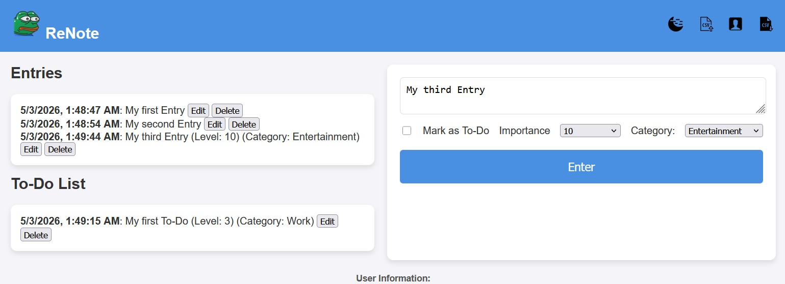
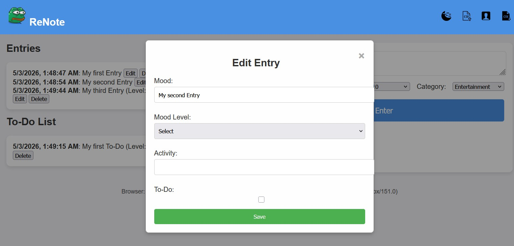
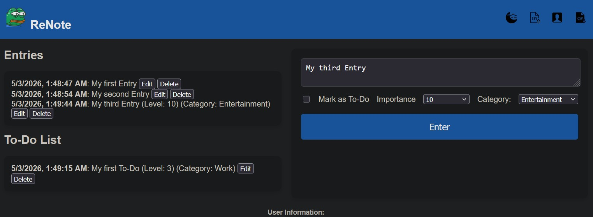

# ReNote

ReNote is a small vanilla JavaScript project built in one evening as a frontend practice exercise.  
It is a browser-based notes and task tracker with local persistence and basic entry management.

## Features

- Add text entries through a form
- Mark entries as to-do items
- Assign a priority level
- Select a category for each entry
- Edit and delete saved entries
- Export entries to CSV
- Import entries from CSV
- Save data in browser localStorage
- Toggle between light and dark themes

## Screenshots

### Main view

### Modal editor

### Dark theme

## How to run

1. Clone the repository.
2. Open `index.html` in a browser.

## Technologies
HTML
CSS
JavaScript
Limitations
No backend
No authentication
No server-side storage
CSV parsing is basic
Designed as a learning project, not a production application